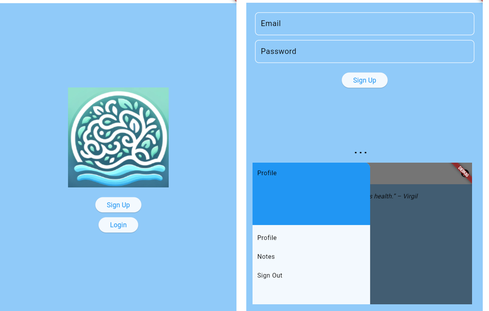
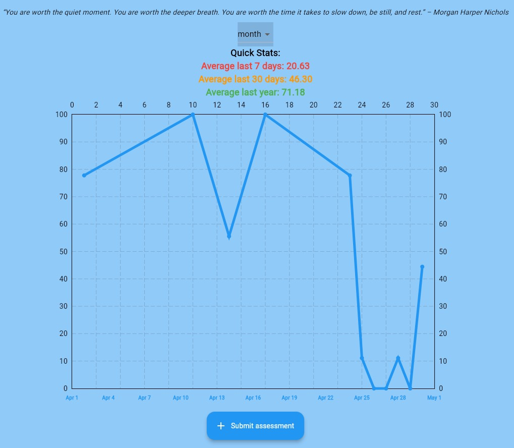
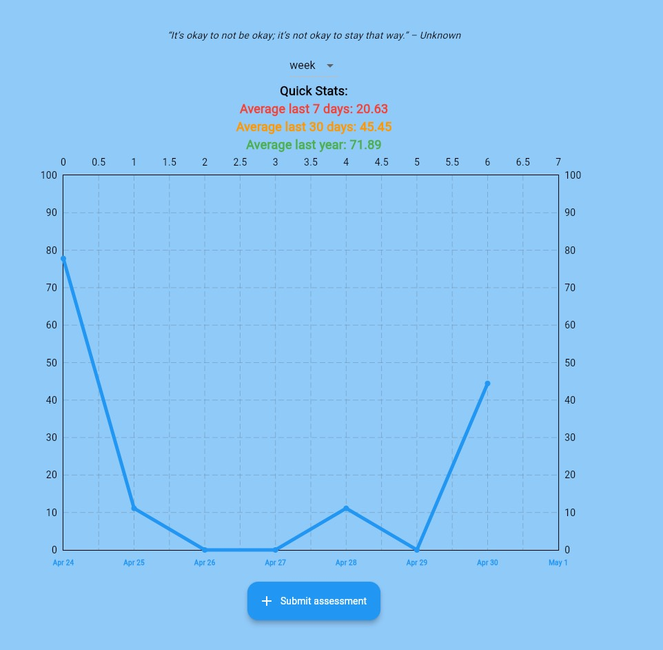

# HealthHUB - Mental Health Questionnaire App





## Overview

HealthHUB is a Flutter-based mobile application designed to provide mental health assessments and recommendations. Users can answer a series of questions to assess their mental well-being, and the app provides feedback on whether they should seek professional help based on their responses. The app also integrates with Firebase for user authentication and data storage.

## Features

- User authentication with Firebase (Sign Up, Login, Logout)
- Mental health assessments based on various categories like Anxiety, Depression, Anger, Happiness, etc.
- Personalized feedback and recommendations using a trained machine learning model
- Data visualization with dynamic graphs to track mental health trends
- User profile management and note-taking functionality

## Prerequisites

Before you begin, ensure you have met the following requirements:

- [Flutter SDK](https://flutter.dev/docs/get-started/install)
- [Firebase CLI](https://firebase.google.com/docs/cli)
- Python environment (optional, if you plan to train the machine learning model)
- Git for version control

## Installation

To set up the project locally, follow these steps:

1. **Clone the repository:**

   ```bash
   git clone https://github.com/Andrew-Manyak/HealthHub.git
   cd HealthHub
